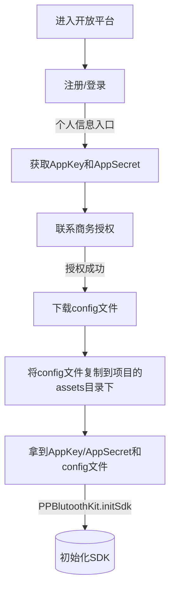

[English Docs](README_EN.md)  |  [中文文档](README.md)

[乐福开放平台](https://uniquehealth.lefuenergy.com/unique-open-web/#/document)  |  
[PPBluetoothKit iOS SDK](https://uniquehealth.lefuenergy.com/unique-open-web/#/document?url=https://lefuhengqi.apifox.cn/doc-2625647)  |  
[PPBluetoothKit 微信小程序插件](https://uniquehealth.lefuenergy.com/unique-open-web/#/document?url=https://lefuhengqi.apifox.cn/doc-2625745)

[Android示例程序地址](https://gitee.com/shenzhen-lfscale/bluetooth-kit-android-demo.git)

# PPBluetoothKit Android SDK
PPBluetoothKit是针对人体秤和食物秤进行封装的SDK，包含蓝牙连接逻辑、数据解析逻辑、体脂计算。

### 示例程序
为了让客户快速实现称重以及对应的功能而实现，提供了一个示例程序，示例程序中包含体脂计算模块和设备功能模块。

- 设备功能模块目前支持的设备包含：蓝牙秤、食物秤、Torre系列蓝牙WiFi体脂秤。
- 体脂计算模块支持4电极交流算法、4电极直流算法、8电极交流算法。

### 商用版本程序

- 可在各个应用市场搜索下载 "Unique Health"

## Ⅰ. 集成方式

### 1.1 申请AppKey、AppSecret和config文件

- 先到[乐福开放平台](https://uniquehealth.lefuenergy.com/unique-open-web/#/document)申请AppKey、AppSecret和config文件
- 将config文件放到项目的assets目录下



### 1.2 SDK初始化
```  
 //使用时请务必替换成你自己的AppKey/AppSecret，需要增加设备配置请联系我司销售顾问  
 val appKey = "" val appSecret = ""  
 /*********************以下内容为SDK的配置项***************************************/  
 //SDK日志打印控制，true会打印  
 PPBlutoothKit.setDebug(BuildConfig.DEBUG) /** * SDK 初始化 所需参数需要自行到开放平台自行申请，请勿直接使用Demo中的参数，  
 * @param appKey App的标识  
 * @param appSecret Appp的密钥  
 * @param configPath 在开放平台下载相应的配置文件以.config结尾，并放到assets目录下，将config文件全名传给SDK  
 */ PPBlutoothKit.initSdk(this, appKey, appSecret, "lefu.config")```  
  
### 1.3 aar文件导入  
  
- 在需要引入sdk的module下的build.gradle中加入(最新版本请查看ppscalelib的module下的libs)  
  
```  
dependencies { //aar引入  
api(name: 'ppblutoothkit-3.1.0-20230829.165034-1', ext: 'aar') }
```  
### 1.4 集成常见问题  
  
- 如果遇到集成后提示“AndroidManifest.xml”相关的报错，请尝试着在主module中加入以下代码解决：  
  
```  
android { ``` packagingOptions { exclude 'AndroidManifest.xml' ``` } }```

- 如果遇到“.so”类型的文件错误，请尝试清除缓存，并将集成sdk的方式改为api

- 如遇到其他集成的问题请咨询：yanfabu-5@lefu.cc 或联系我们的销售顾问

- 如你有好的建议或优秀的代码你可以在Gitee上提交你的请求，我们会非常感谢你

## Ⅱ .使用说明

### 1.1 蓝牙权限相关

#### 1.1.1 运行环境

由于需要蓝牙连接，Demo需要真机运行，Android手机6.0及以上或HarmonyOS2.0及以上

#### 1.1.2 蓝牙权限相关约定

使用Demo过程中需要您打开蓝牙，打开定位开关，需确保开启和授权必要的权限: 精准定位权限和附近的设备权限  
可以查看官方蓝牙权限文档，文档地址：[Google开发者网站关于Bluetooth permissions说明](https://developer.android.com/guide/topics/connectivity/bluetooth/permissions).

- 精准定位权限
- 附近设备权限
- 定位开关
- 蓝牙开关

```  
<manifest>  
 <!-- Request legacy Bluetooth permissions on older devices. --> <uses-permission android:name="android.permission.BLUETOOTH" android:maxSdkVersion="30" /> <uses-permission android:name="android.permission.BLUETOOTH_ADMIN" android:maxSdkVersion="30" />  
 <!-- Needed only if your app looks for Bluetooth devices. If your app doesn't use Bluetooth scan results to derive physical location information, you can strongly assert that your app doesn't derive physical location. --> <uses-permission android:name="android.permission.BLUETOOTH_SCAN" />  
 <!-- Needed only if your app makes the device discoverable to Bluetooth devices. --> <uses-permission android:name="android.permission.BLUETOOTH_ADVERTISE" />  
 <!-- Needed only if your app communicates with already-paired Bluetooth devices. --> <uses-permission android:name="android.permission.BLUETOOTH_CONNECT" />  
 <!-- Needed only if your app uses Bluetooth scan results to derive physical location. --> <uses-permission android:name="android.permission.ACCESS_FINE_LOCATION" /> ...</manifest>  
  
```  

### 1.2 测量身体数据相关约定

#### 1.2.1 称重测脂注意事项

- 秤支持测脂
- 光脚上称，并接触对应的电极片
- 称重接口返回体重(kg)和阻抗信息
- 人体参数身高、年龄输入正确

#### 1.2.2 体脂计算

##### 基础参数约定
| 类别 | 输入范围 | 单位 |  
|:----|:--------|:--:|  
| 身高 | 100-220 | cm |  
| 年龄 | 10-99   | 岁 |  
| 性别 | 0/1     | 女/男 |  
| 体重 | 0-220   | kg |

- 需要身高、年龄、性别和对应的阻抗，调用对应的计算库去获得
- 8电极所涉及的体脂数据项需要8电极的秤才可使用

##  Ⅲ. 计算体脂 - Caclulate - CalculateManagerActivity

### 1.1  体脂计算所需参数说明

根据蓝牙协议解析出的体重、阻抗，加上用户数据的身高、年龄、性别，计算出体脂率等多项体脂参数信息。

#### 1.1.1   PPBodyBaseModel
| 参数   | 注释|  说明 |
| :--------  | :-----  | :----:  |
| weight | 体重 | 实际体重*100取整|
| impedance|四电极算法阻抗 |四电极算法字段|
| zTwoLegsDeCode|四电极脚对脚明文阻抗值 |四电极算法字段|
| userModel|用户基础信息对象 |PPUserModel|
| deviceModel-deviceCalcuteType| 对应设备的计算方式 |后面具体说明|
| isHeartRating| 是否正在测量心率 |心率测量状态|
| unit| 秤端的当前单位 |实时单位|
| heartRate| 心率 |秤端支持心率生效|
| isPlus| 是否是正数 |食物秤生效|
| memberId| 成员Id |秤端支持用户时生效|
| z100KhzLeftArmEnCode| 100KHz左手阻抗加密值 |八电极字段|
| z100KhzLeftLegEnCode| 100KHz左腳阻抗加密值 |八电极字段|
| z100KhzRightArmEnCode| 100KHz右手阻抗加密值 |八电极字段|
| z100KhzRightLegEnCode| 100KHz右腳阻抗加密值 |八电极字段|
| z100KhzTrunkEnCode| 100KHz軀幹阻抗加密值 |八电极字段|
| z20KhzLeftArmEnCode| 20KHz左手阻抗加密值 |八电极字段|
| z20KhzLeftLegEnCode| 20KHz左腳阻抗加密值 |八电极字段|
| z20KhzRightArmEnCode|20KHz右手阻抗加密值 |八电极字段|
| z20KhzRightLegEnCode| 20KHz右腳阻抗加密值 |八电极字段|
| z20KhzTrunkEnCode| 20KHz軀幹阻抗加密值 |八电极字段|
| z100KhzLeftArmDeCode| 100KHz左手阻抗解密值 |八电极字段|
| z100KhzLeftLegDeCode| 100KHz左腳阻抗解密值 |八电极字段|
| z100KhzRightArmDeCode| 100KHz右手阻抗解密值 |八电极字段|
| z100KhzRightLegDeCode| 100KHz右腳阻抗解密值 |八电极字段|
| z100KhzRightArmDeCode| 100KHz左手阻抗解密值 |八电极字段|
| z100KhzTrunkDeCode| 100KHz軀幹阻抗解密值 |八电极字段|
| z20KhzLeftArmDeCode| 20KHz左手阻抗解密值 |八电极字段|
| z20KhzLeftLegDeCode| 20KHz左腳阻抗解密值 |八电极字段|
| z20KhzRightArmDeCode| 20KHz右手阻抗解密值 |八电极字段|
| z20KhzRightLegDeCode| 20KHz右腳阻抗解密值 |八电极字段|
| z20KhzTrunkDeCode| 20KHz軀幹阻抗解密值 |八电极字段|

#### 1.1.2 计算类型说明  PPDeviceModel - deviceCalcuteType
| PPDeviceCalcuteType   | 注释|  使用范围 |
| :--------  | :-----  | :----:  |
| PPDeviceCalcuteTypeInScale | 秤端计算 | 秤端计算的秤|
| PPDeviceCalcuteTypeDirect| 直流 | 四电极直流体脂秤|
| PPDeviceCalcuteTypeAlternate| 四电极交流 | 四电极体脂秤|
| PPDeviceCalcuteTypeAlternate8| 8电极交流算法 | 八电极体脂秤|
| PPDeviceCalcuteTypeNormal| 默认计算方式 | 4电极交流 |
| PPDeviceCalcuteTypeNeedNot| 不需要计算 | 食物秤或人体秤|
| PPDeviceCalcuteTypeAlternate8_0| 8电极算法 |八电极体脂秤|

#### 1.1.3 用户基础信息说明 PPUserModel
| 参数   | 注释|  说明 |
| :--------  | :-----  | :----:  |
| userHeight| 身高|所有体脂秤|
| age| 年龄 |所有体脂秤|
| sex| 性别 |所有体脂秤|

### 1.2  八电极交流体脂计算 - 8AC - Calculate8Activitiy

**八电极计算体脂示例:**

```
 //八电极计算类型  
 deviceModel.deviceCalcuteType = PPScaleDefine.PPDeviceCalcuteType.PPDeviceCalcuteTypeAlternate8  

val userModel = PPUserModel.Builder()  
    .setSex(sex) //gender  
  .setHeight(height)//height 100-220  
  .setAge(age)//age 10-99  
  .build()  
  
val deviceModel = PPDeviceModel("", DeviceManager.CF568_CF577)//更换成你自己的设备蓝牙名称
deviceModel.deviceCalcuteType = PPScaleDefine.PPDeviceCalcuteType.PPDeviceCalcuteTypeAlternate8  
deviceModel.deviceAccuracyType = if (DeviceUtil.Point2_Scale_List.contains(deviceModel.deviceName)) {  
    PPScaleDefine.PPDeviceAccuracyType.PPDeviceAccuracyTypePoint005  
} else {  
    PPScaleDefine.PPDeviceAccuracyType.PPDeviceAccuracyTypePoint01  
}  
val bodyBaseModel = PPBodyBaseModel()  
bodyBaseModel.weight = UnitUtil.getWeight(weight)  
bodyBaseModel.deviceModel = deviceModel  
bodyBaseModel.userModel = userModel  
  
bodyBaseModel.z100KhzLeftArmEnCode = z100KhzLeftArmEnCode  
bodyBaseModel.z100KhzLeftLegEnCode = z100KhzLeftLegEnCode  
bodyBaseModel.z100KhzRightArmEnCode = z100KhzRightArmEnCode  
bodyBaseModel.z100KhzRightLegEnCode = z100KhzRightLegEnCode  
bodyBaseModel.z100KhzTrunkEnCode = z100KhzTrunkEnCode  
bodyBaseModel.z20KhzLeftArmEnCode = z20KhzLeftArmEnCode  
bodyBaseModel.z20KhzLeftLegEnCode = z20KhzLeftLegEnCode  
bodyBaseModel.z20KhzRightArmEnCode = z20KhzRightArmEnCode  
bodyBaseModel.z20KhzRightLegEnCode = z20KhzRightLegEnCode  
bodyBaseModel.z20KhzTrunkEnCode = z20KhzTrunkEnCode  
  
val fatModel = PPBodyFatModel(bodyBaseModel)  
  
DataUtil.util().bodyDataModel = fatModel  
Log.d("liyp_", fatModel.toString())
 ```  

### 1.3   四电极直流体脂计算 - 4DC - Calculate4DCActivitiy

**四电极直流计算体脂示例:**
  ```  
val userModel = PPUserModel.Builder()  
    .setSex(sex) //gender  
  .setHeight(height)//height 100-220  
  .setAge(age)//age 10-99  
  .build()  
  
val deviceModel = PPDeviceModel("", DeviceManager.FL_SCALE)//更换成你自己的设备蓝牙名称
deviceModel.deviceCalcuteType = PPScaleDefine.PPDeviceCalcuteType.PPDeviceCalcuteTypeDirect  
val bodyBaseModel = PPBodyBaseModel()  
bodyBaseModel.weight = UnitUtil.getWeight(weight)  
bodyBaseModel.impedance = impedance  
bodyBaseModel.deviceModel = deviceModel  
bodyBaseModel.userModel = userModel  
bodyBaseModel.unit = PPUnitType.Unit_KG  
  
val ppBodyFatModel = PPBodyFatModel(bodyBaseModel)  
  
DataUtil.util().bodyDataModel = ppBodyFatModel  
Log.d("liyp_", ppBodyFatModel.toString())
```  


### 1.4  四电极交流体脂计算 - 4AC - Calculate4ACActivitiy

**四电极交流计算体脂示例:**
```
val userModel = PPUserModel.Builder()  
    .setSex(sex) //gender  
  .setHeight(height)//height 100-220  
  .setAge(age)//age 10-99  
  .build()  
  
val deviceModel = PPDeviceModel("", DeviceManager.CF568)///更换成你自己的设备蓝牙名称
deviceModel.deviceCalcuteType = PPScaleDefine.PPDeviceCalcuteType.PPDeviceCalcuteTypeAlternate  
deviceModel.deviceAccuracyType = if (DeviceUtil.Point2_Scale_List.contains(deviceModel.deviceName)) {  
    PPScaleDefine.PPDeviceAccuracyType.PPDeviceAccuracyTypePoint005  
} else {  
    PPScaleDefine.PPDeviceAccuracyType.PPDeviceAccuracyTypePoint01  
}  
  
val bodyBaseModel = PPBodyBaseModel()  
bodyBaseModel.weight = UnitUtil.getWeight(weight)  
bodyBaseModel.impedance = impedance  
bodyBaseModel.deviceModel = deviceModel  
bodyBaseModel.userModel = userModel  
bodyBaseModel.unit = PPUnitType.Unit_KG  
  
val ppBodyFatModel = PPBodyFatModel(bodyBaseModel)  
DataUtil.util().bodyDataModel = ppBodyFatModel  
Log.d("liyp_", ppBodyFatModel.toString())
```
##  Ⅳ. 设备扫描 - Device-ScanDeviceListActivity

### 1.1 设备分类定义-  PPDevicePeripheralType

扫描设备会返回PPDeviceModel对象，通过设备的方法：deviceModel.getDevicePeripheralType()，获取设备分类，根据PPDevicePeripheralType区分自己的设备，对应设备功能示例的Activity。

| 分类枚举 | 使用示例类 | 连接方式 | 设备类型 |协议类型
|------|--------|--------|--------|  --------|
| PeripheralApple | PeripheralAppleActivity | 连接 | 人体秤  | 2.x
| PeripheralBanana | PeripheralBananaActivity | 广播 | 人体秤  | 2.x
| PeripheralCoconut | PeripheralCoconutActivity | 连接 | 人体秤  | 3.x
| PeripheralDurian | PeripheralDutianActivity | 设备端计算的连接 | 人体秤 | 2.x
| PeripheralEgg | PeripheralEggActivity | 连接 | 厨房秤  | 2.x
| PeripheralFish | PeripheralFishActivity | 连接 | 厨房秤  |3.x
| PeripheralGrapes | PeripheralGrapesActivity | 广播 | 厨房秤  | 2.x
| PeripheralHamburger | PeripheralHamburgerActivity | 广播 | 厨房秤 | 3.x
| PeripheralTorre | PeripheralTorreActivity | 连接 | 人体秤  | Torre
| PeripheralIce | PeripheralIceActivity | 连接 | 人体秤  | 4.x
| PeripheralJambul | PeripheralJambulActivity | 广播 | 人体秤 |  3.x

### 1.2 扫描周围支持的设备-ScanDeviceListActivity

**注意：**
- 如果你在多个页面之间需要启动扫描，建议把扫描逻辑，放到工具类中，并用单例进行包裹
- 如果有连续页面需要调用扫描时，请一定要确保上个页面的蓝牙已停止扫描后，再在第二个页面进行扫描，建议是第二个页面延迟1000ms再启动。
- 如果你需要一直扫描蓝牙，你要在monitorBluetoothWorkState方法中ppBleWorkState返回PPBleWorkState.PPBleWorkSearchTimeOut时重启扫描，以确保循环扫描

####  启动扫描 - startSearchDeviceList
```  
 /** * Get around bluetooth scale devices */
  public void startScanDeviceList() {
   if (ppScale == null) { 
   ppScale = new PPSearchManager(); 
   } 
   //You can dynamically set the scan time in ms  
   ppScale.startSearchDeviceList(300000, searchDeviceInfoInterface，bleStateInterface);  
 }  
``` 

**处理扫描结果-PPSearchDeviceInfoInterface**

```  
/**  
 * @param ppDeviceModel 设备对象  
 * @param data 广播数据  
 */
public void onSearchDevice(PPDeviceModel ppDeviceModel, String data) {}
```  
**蓝牙相关状态监听-PPBleStateInterface**

```  
/**  
 * 蓝牙扫描和连接状态回调  
  * @param ppBleWorkState 蓝牙状态标识  
  * @param deviceModel 设备对象  
  */  
@Override  
public void monitorBluetoothWorkState(PPBleWorkState ppBleWorkState, PPDeviceModel deviceModel) {}
/**  
 * 系统蓝牙状态回调  
  * @param ppBleSwitchState 系统蓝牙状态标识  
  */  
@Override  
public void monitorBluetoothSwitchState(PPBleSwitchState ppBleSwitchState) {}
```

**蓝牙状态PPBleWorkState**

| 分类枚举 | 说明 | 备注
|------|--------|--------|
| PPBleWorkStateSearching | 扫描中|
| PPBleWorkSearchTimeOut| 扫描超时| 如有需要可重启扫描
| PPBleWorkSearchFail | 扫描失败|  如有需要可重启扫描
| PPBleStateSearchCanceled| 停止扫描|  主动调用停止扫描
| PPBleWorkStateConnecting| 设备连接中|
| PPBleWorkStateConnected | 设备已连接| 连接上后，建议在PPBleWorkStateWritable中下发数据
| PPBleWorkStateConnectFailed| 连接失败|
| PPBleWorkStateDisconnected| 设备已断开|
| PPBleWorkStateWritable| 可写 | 连接后如有需要给设备发送信息，可在此依次发送

#### 停止扫描

```  
ppScale.stopSearch(); 
 ```  

#### 重启扫描
重启扫描建议延迟1-2s再启动，防止触发Android系统的频繁扫描
```  
 public void delayScan() {
	new Handler(getMainLooper()).postDelayed(new Runnable() {
	   @Override public void run() {
		   if (isOnResume) {
			     startScanDeviceList(); 
			     } 
		     } 
	  }, 1000);  
 }
 ```  
### 2.1 PeripheralApple功能说明  -PeripheralAppleActivity

### 2.2 PeripheralBanana 功能说明  -PeripheralBanana Activity

### 2.3 PeripheralCoconut功能说明  -PeripheralCoconutActivity

### 2.4 PeripheralDurian功能说明  -PeripheralDurianActivity

### 2.5 PeripheralEgg功能说明  -PeripheralEggActivity

### 2.6 PeripheralFish功能说明  -PeripheralFishActivity

### 2.7 PeripheralGrapes功能说明  -PeripheralGrapesActivity

### 2.8 PeripheralHamburger功能说明  -PeripheralHamburgerActivity

### 2.9 PeripheralTorre功能说明  -PeripheralTorreActivity

### 2.10 PeripheralIce功能说明  -PeripheralIceActivity

### 2.11 PeripheralJambul功能说明  -PeripheralJambulActivity


### Ⅲ WiFi功能说明

#### PeripheralApple的Wifi功能 = BleConfigWifiActivity.java

    只有部分设备支持WiFi  
检测是否支持Wifi:

```  
 /** * 是否支持Wifi  
 * * @param device * @return */ fun isFuncTypeWifi(device: PPDeviceModel?): Boolean { return if (device != null) { (device.deviceFuncType and PPScaleDefine.PPDeviceFuncType.PPDeviceFuncTypeWifi.getType() == PPScaleDefine.PPDeviceFuncType.PPDeviceFuncTypeWifi.getType()) } else { false } }  
```  

##### 1.1 注意事项

默认Server域名地址是：https://api.lefuenergy.com

1. 确保Server正常，路由器能正常连接到Server
2. 确保WiFi环境是2.4G或2.4/5G混合模式，不支持单5G模式
3. 确保账号密码正确
4. 确保秤端使用的Server地址与App使用的Server地址对应

##### 1.2 WiFi配网的基本流程

蓝牙配网 - 该功能用于蓝牙WiFi秤，在给秤配置网络时使用

1.首先确保已经绑定了蓝牙WiFi秤  
2.用户输入Wifi账号和密码  
3.发起连接设备，  
4.连接成功后，在可写的回调（PPBleWorkStateWritable）里面，将账号和密码发送给秤

```  
 ppScale.configWifi(ssid, password)```  
  
5、在PPConfigWifiInterface的监听器里面monitorConfigState方法返回sn码，此时秤上的WiFi图标会先闪烁（连接路由器中），再常量（连接路由器成功并获取到sn），  
6、将sn传给Server验证秤是否已经完成注册  
7、Server返回成功，则配网成功，否则配网失败  
  
##### 1.3 数据列表  
  
数据列表 -是从Server端获取的秤存在Server端的离线数据,并非秤端存储的历史数据  
  
##### 1.4 设备配置  
  
在设备管理页面，如果绑定了WiFi秤，则会显示设置入口，点击设置入口可进入到设备配置页面,  
设备配置页面可以查看当前设备的SN,SSID,PASSWORD、修改秤的服务端DNS地址、清除当前秤的SSID,  
对应的代码是在DeveloperActivity.class下。  
  
#### PeripheralTorre的Wifi功能  
  
1. 首先从设备端读取Wifi列表 - PeripheralTorreSearchWifiListActivity  
2. 然后选则一个Wifi  
3. 输入密码 - PeripheralTorreConfigWifiActivity  
4. 启动配网  
  
```  
var pwd = "" if (etWifiKey.text != null) { pwd = etWifiKey.text.toString() } val domainName = "http://nat.lefuenergy.com:10081"//动态配置服务器地址，需要后台配合提供  
PPBlutoothPeripheralTorreInstance.instance.controller?.getTorreDeviceManager()?.configWifi(ssid, pwd, domainName, configWifiInterface)```

5. 配网完成

```  
 val configWifiInterface = object : PPTorreConfigWifiInterface() {  
 override fun configResult(configStateMenu: PPConfigStateMenu?, resultCode: String?) { configResultTV?.text = "configResult configStateMenu: $configStateMenu\nresultCode: $resultCode" }  
 }```  
  
6. 退出配网  
  
```  
PPBlutoothPeripheralTorreInstance.instance.controller?.getTorreDeviceManager()?.exitConfigWifi()```

7. 配网接口说明-PPTorreConfigWifiInterface

```  
 public class PPTorreConfigWifiInterface {  
 /** * 配网状态  
 * * @param configStateMenu * @param resultCode */ public void configResult(PPConfigStateMenu configStateMenu, String resultCode) { }  
 /** * Wifi列表回调  
 * * @param wifiModels 返回的Wifi信息列表  
 */ public void monitorWiFiListSuccess(List<PPWifiModel> wifiModels) { }  
 /** * 读取设备的SSID  
 * * @param ssid * @param state 0 成功 1失败  
 */ public void readDeviceSsidCallBack(String ssid, int state) { }  
 /** * 读取wifimac  
 * * @param wifiMac */ public void readDeviceWifiMacCallBack(String wifiMac) {  
 }  
  
 /** * 配网状态  
 * 0x00：未配网（设备端恢复出厂或APP解除设备配网后状态）  
 * 0x01：已配网（APP已配网状态）  
 * * @param state */ public void configWifiState(int state) { } }```  
  
### IV 厨房秤枚举具体参数说明  
  
#### 1.1 单位枚举类 PPUnitType  
  
```  
Unit_KG(0),//KG        Unit_LB(1),//LB  
PPUnitST(2),//ST PPUnitJin(3),//斤  
PPUnitG(4),//g PPUnitLBOZ(5),//lb:oz PPUnitOZ(6),//oz PPUnitMLWater(7),//ml(water) PPUnitMLMilk(8);//milk```

#### 1.2 单位精度

```  
 enum class PPDeviceAccuracyType { PPDeviceAccuracyTypeUnknow(0),//未知精度  
 //KG精度0.1  
 PPDeviceAccuracyTypePoint01(1), //KG精度0.05  
 PPDeviceAccuracyTypePoint005(2), // 1G精度  
 PPDeviceAccuracyTypePointG(3), // 0.1G精度  
 PPDeviceAccuracyTypePoint01G(4); }```  
  
#### 1.3  食物秤与体脂秤的区别  
  
##### 1.3.1  接收数据的接口不一样  
  
ProtocalFilterImpl中接收数据的监听器食物秤是FoodScaleDataProtocoInterface，体脂秤是由PPProcessDateInterface(过程数据)、PPLockDataInterface(锁定数据)。  
  
##### 1.3.2  接收数据的重量单位不一样  
  
体脂秤的重量值对应的单位是KG,食物秤的重量值对应的单位是g，重量值对应的单位是固定的。（这里的单位与PPScale给的单位不是同步的，PPScale给的单位是当前秤端的单位）  
  
### V .实体类对象及具体参数说明  
  
#### 1.1 PPBodyBaseModel参数说明  
  
```  
//体重 重量放大了100倍  
@JvmField var weight = 0  
//4电极算法阻抗  
@JvmField var impedance: Long = 0  
//脚对脚明文阻抗值(Ω), 范围200.0 ~ 1200.0  
var ppZTwoLegs = 0  
//设备信息  
@JvmField var deviceModel: PPDeviceModel? = null  
//用户信息  
@JvmField var userModel: PPUserModel? = null  
//心率是否测量中  
@JvmField var isHeartRating = false  
//本次测量是否结束  
var isEnd = true  
//设备单位 重量单位 默认kg  
@JvmField var unit: PPUnitType? = null  
//心率  
@JvmField var heartRate = 0  
// 是否超载  
@JvmField var isOverload = false  
// 是否是正数  
@JvmField var isPlus = true  
//formate yyyy-MM-dd HH:mm:ss @JvmField var dateStr = ""  
//数据归属 torre协议用  
@JvmField var memberId = ""  
/****************************8电极（Torre）阻抗*****************************************/

//100KHz左手阻抗加密值(下位机上传值)  
@JvmField var z100KhzLeftArmEnCode: Long = 0  
//100KHz左腳阻抗加密值(下位机上传值)  
@JvmField var z100KhzLeftLegEnCode: Long = 0  
//100KHz右手阻抗加密值(下位机上传值)  
@JvmField var z100KhzRightArmEnCode: Long = 0  
//100KHz右腳阻抗加密值(下位机上传值)  
@JvmField var z100KhzRightLegEnCode: Long = 0  
//100KHz軀幹阻抗加密值(下位机上传值)  
@JvmField var z100KhzTrunkEnCode: Long = 0  
//20KHz左手阻抗加密值(下位机上传值)  
@JvmField var z20KhzLeftArmEnCode: Long = 0  
//20KHz左腳阻抗加密值(下位机上传值)  
@JvmField var z20KhzLeftLegEnCode: Long = 0  
//20KHz右手阻抗加密值(下位机上传值)  
@JvmField var z20KhzRightArmEnCode: Long = 0  
//20KHz右腳阻抗加密值(下位机上传值)  
@JvmField var z20KhzRightLegEnCode: Long = 0  
//20KHz軀幹阻抗加密值(下位机上传值)  
@JvmField var z20KhzTrunkEnCode: Long = 0```

#### 1.2 PPBodyFatModel 体脂计算对象参数说明

```  
 //用于存储计算所必须的参数  
 var ppBodyBaseModel: PPBodyBaseModel? = null var ppSDKVersion: String? = null//计算库版本号  
  
 // 性别  
 var ppSex: PPUserGender = ppBodyBaseModel?.userModel?.sex ?: PPUserGender.PPUserGenderFemale  
 // 身高(cm)  
 var ppHeightCm: Int = ppBodyBaseModel?.userModel?.userHeight ?: 100  
 // 年龄(岁)  
 var ppAge: Int = ppBodyBaseModel?.userModel?.age ?: 0  
 // 体脂错误类型  
 var errorType: BodyFatErrorType = BodyFatErrorType.PP_ERROR_TYPE_NONE  
 // 数据区间范围和介绍描述  
 var bodyDetailModel: PPBodyDetailModel? = null  
 /**************** 四电极算法 ****************************/ // 体重(kg)  
 var ppWeightKg: Float = (ppBodyBaseModel?.weight?.toFloat() ?: 0.0f).div(100.0f)  
 var ppWeightKgList: List<Float>? = null  
 // Body Mass Index var ppBMI: Float = 0f var ppBMIList: List<Float>? = null  
 // 脂肪率(%)  
 var ppFat: Float = 0f var ppFatList: List<Float>? = null  
 // 脂肪量(kg)  
 var ppBodyfatKg: Float = 0f var ppBodyfatKgList: List<Float>? = null  
 // 肌肉率(%)  
 var ppMusclePercentage: Float = 0f var ppMusclePercentageList: List<Float>? = null  
 // 肌肉量(kg)  
 var ppMuscleKg: Float = 0f var ppMuscleKgList: List<Float>? = null  
 // 骨骼肌率(%)  
 var ppBodySkeletal: Float = 0f var ppBodySkeletalList: List<Float>? = null  
 // 骨骼肌量(kg)  
 var ppBodySkeletalKg: Float = 0f var ppBodySkeletalKgList: List<Float>? = null  
 // 水分率(%), 分辨率0.1,  
 var ppWaterPercentage: Float = 0f var ppWaterPercentageList: List<Float>? = null  
 //水分量(Kg)  
 var ppWaterKg: Float = 0f var ppWaterKgList: List<Float>? = null  
 // 蛋白质率(%)  
 var ppProteinPercentage: Float = 0f var ppProteinPercentageList: List<Float>? = null  
 //蛋白质量(Kg)  
 var ppProteinKg: Float = 0f var ppProteinKgList: List<Float>? = null  
 // 去脂体重(kg)  
 var ppLoseFatWeightKg: Float = 0f var ppLoseFatWeightKgList: List<Float>? = null  
 // 皮下脂肪率(%)  
 var ppBodyFatSubCutPercentage: Float = 0f var ppBodyFatSubCutPercentageList: List<Float>? = null  
 // 皮下脂肪量  
 var ppBodyFatSubCutKg: Float = 0f var ppBodyFatSubCutKgList: List<Float>? = null  
 // 心率(bmp)  
 var ppHeartRate: Int = ppBodyBaseModel?.heartRate ?: 0 var ppHeartRateList: List<Float>? = null  
 // 基础代谢  
 var ppBMR: Int = 0 var ppBMRList: List<Float>? = null  
 // 内脏脂肪等级  
 var ppVisceralFat: Int = 0 var ppVisceralFatList: List<Float>? = null  
 // 骨量(kg)  
 var ppBoneKg: Float = 0f var ppBoneKgList: List<Float>? = null  
 // 肌肉控制量(kg)  
 var ppBodyMuscleControl: Float = 0f  
 // 脂肪控制量(kg)  
 var ppFatControlKg: Float = 0f  
 // 标准体重  
 var ppBodyStandardWeightKg: Float = 0f  
 // 理想体重(kg)  
 var ppIdealWeightKg: Float = 0f  
 // 控制体重(kg)  
 var ppControlWeightKg: Float = 0f  
 // 身体类型  
 var ppBodyType: PPBodyDetailType? = null  
 // 肥胖等级  
 var ppFatGrade: PPBodyFatGrade? = null var ppFatGradeList: List<Float>? = null  
 // 健康评估  
 var ppBodyHealth: PPBodyHealthAssessment? = null var ppBodyHealthList: List<Float>? = null  
 // 身体年龄  
 var ppBodyAge: Int = 0 var ppBodyAgeList: List<Float>? = null  
 // 身体得分  
 var ppBodyScore: Int = 0 var ppBodyScoreList: List<Float>? = null  
 /**************** 八电极算法独有 ****************************/  
 // 輸出參數-全身体组成:身体细胞量(kg)  
 var ppCellMassKg: Float = 0.0f var ppCellMassKgList: List<Float> = listOf()  
 // 輸出參數-评价建议:建议卡路里摄入量 Kcal/day var ppDCI: Int = 0  
 // 輸出參數-全身体组成:无机盐量(Kg)  
 var ppMineralKg: Float = 0.0f var ppMineralKgList: List<Float> = listOf()  
 // 輸出參數-评价建议: 肥胖度(%)  
 var ppObesity: Float = 0.0f var ppObesityList: List<Float> = listOf()  
 // 輸出參數-全身体组成:细胞外水量(kg)  
 var ppWaterECWKg: Float = 0.0f var ppWaterECWKgList: List<Float> = listOf()  
 // 輸出參數-全身体组成:细胞内水量(kg)  
 var ppWaterICWKg: Float = 0.0f var ppWaterICWKgList: List<Float> = listOf()  
 // 左手脂肪量(%), 分辨率0.1  
 var ppBodyFatKgLeftArm: Float = 0.0f  
 // 左脚脂肪量(%), 分辨率0.1  
 var ppBodyFatKgLeftLeg: Float = 0.0f  
 // 右手脂肪量(%), 分辨率0.1  
 var ppBodyFatKgRightArm: Float = 0.0f  
 // 右脚脂肪量(%), 分辨率0.1  
 var ppBodyFatKgRightLeg: Float = 0.0f  
 // 躯干脂肪量(%), 分辨率0.1  
 var ppBodyFatKgTrunk: Float = 0.0f  
 // 左手脂肪率(%), 分辨率0.1  
 var ppBodyFatRateLeftArm: Float = 0.0f  
 // 左脚脂肪率(%), 分辨率0.1  
 var ppBodyFatRateLeftLeg: Float = 0.0f  
 // 右手脂肪率(%), 分辨率0.1  
 var ppBodyFatRateRightArm: Float = 0.0f  
 // 右脚脂肪率(%), 分辨率0.1  
 var ppBodyFatRateRightLeg: Float = 0.0f  
 // 躯干脂肪率(%), 分辨率0.1  
 var ppBodyFatRateTrunk: Float = 0.0f  
 // 左手肌肉量(kg), 分辨率0.1  
 var ppMuscleKgLeftArm: Float = 0.0f  
 // 左脚肌肉量(kg), 分辨率0.1  
 var ppMuscleKgLeftLeg: Float = 0.0f  
 // 右手肌肉量(kg), 分辨率0.1  
 var ppMuscleKgRightArm: Float = 0.0f  
 // 右脚肌肉量(kg), 分辨率0.1  
 var ppMuscleKgRightLeg: Float = 0.0f  
 // 躯干肌肉量(kg), 分辨率0.1  
 var ppMuscleKgTrunk: Float = 0.0f```  
  
注意：在使用时拿到对象，请调用对应的get方法来获取对应的值  
  
##### 1.2.1 错误类型 PPBodyfatErrorType  
  
```  
PP_ERROR_TYPE_NONE(0),                  //无错误  
PP_ERROR_TYPE_AGE(1),                   //年龄参数有误，需在 6   ~ 99岁(不计算除BMI/idealWeightKg以外参数)  
PP_ERROR_TYPE_HEIGHT(2),                //身高参数有误，需在 90 ~ 220cm(不计算所有参数)  
PP_ERROR_TYPE_WEIGHT(3),                //体重有误 10 ~ 200kg PP_ERROR_TYPE_SEX(4),                   //性別有误 0 ~ 1 PP_ERROR_TYPE_PEOPLE_TYPE(5),               //身高参数有误，需在 90 ~ 220cm(不计算所有参数)  
PP_ERROR_TYPE_IMPEDANCE_TWO_LEGS(6),        //阻抗有误 200~1200 PP_ERROR_TYPE_IMPEDANCE_TWO_ARMS(7),        //阻抗有误 200~1200 PP_ERROR_TYPE_IMPEDANCE_LEFT_BODY(8),       //阻抗有误 200~1200 PP_ERROR_TYPE_IMPEDANCE_RIGHT_ARM(9),       //阻抗有误 200~1200 PP_ERROR_TYPE_IMPEDANCE_LEFT_ARM(10),        //阻抗有误 200~1200 PP_ERROR_TYPE_IMPEDANCE_LEFT_LEG(11),       //阻抗有误 200~1200 PP_ERROR_TYPE_IMPEDANCE_RIGHT_LEG(12),      //阻抗有误 200~1200 PP_ERROR_TYPE_IMPEDANCE_TRUNK(13);          //阻抗有误 10~100```

##### 1.2.2 健康评估 PPBodyEnum.PPBodyHealthAssessment

```  
 PPBodyAssessment1(0),          //!< 健康存在隐患  
 PPBodyAssessment2(1),          //!< 亚健康  
 PPBodyAssessment3(2),          //!< 一般  
 PPBodyAssessment4(3),          //!< 良好  
 PPBodyAssessment5(4);          //!< 非常好  
```  

##### 1.2.3 肥胖等级 PPBodyEnum.PPBodyFatGrade

```  
 PPBodyGradeFatThin(0),              //!< 偏瘦  
 PPBodyGradeFatStandard(1),          //!< 标准  
 PPBodyGradeFatOverwight(2),         //!< 超重  
 PPBodyGradeFatOne(3),               //!< 肥胖1级  
 PPBodyGradeFatTwo(4),               //!< 肥胖2级  
 PPBodyGradeFatThree(5);             //!< 肥胖3级  
```  

##### 1.2.4 身体类型 PPBodyDetailType

```  
 LF_BODY_TYPE_THIN(0),//偏瘦型  
 LF_BODY_TYPE_THIN_MUSCLE(1),//偏瘦肌肉型  
 LF_BODY_TYPE_MUSCULAR(2),//肌肉发达型  
 LF_BODY_TYPE_LACK_EXERCISE(3),//缺乏运动型  
 LF_BODY_TYPE_STANDARD(4),//标准型  
 LF_BODY_TYPE_STANDARD_MUSCLE(5),//标准肌肉型  
 LF_BODY_TYPE_OBESE_FAT(6),//浮肿肥胖型  
 LF_BODY_TYPE_FAT_MUSCLE(7),//偏胖肌肉型  
 LF_BODY_TYPE_MUSCLE_FAT(8);//肌肉型偏胖  
```  

#### 1.3 设备对象PPDeviceModel 参数说明

```  
 String deviceMac;//设备mac  
 String deviceName;//设备蓝牙名称  
 /** * 设备类型  
 * * @see com.peng.ppscale.business.device.PPDeviceType.ScaleType * @deprecated */ String scaleType; /** * 电量  
 */ int devicePower = -1; /** * 硬件版本号  
 * @deprecated     */  
 String firmwareVersion; /** * 设备类型  
 * * @see PPScaleDefine.PPDeviceType */ public PPScaleDefine.PPDeviceType deviceType; /** * 协议模式  
 * * @see PPScaleDefine.PPDeviceProtocolType */ public PPScaleDefine.PPDeviceProtocolType deviceProtocolType; /** * 计算方式  
 * * @see PPScaleDefine.PPDeviceCalcuteType */ public PPScaleDefine.PPDeviceCalcuteType deviceCalcuteType; /** * 精度  
 * * @see PPScaleDefine.PPDeviceAccuracyType */ public PPScaleDefine.PPDeviceAccuracyType deviceAccuracyType; /** * 供电模式  
 * * @see PPScaleDefine.PPDevicePowerType */ public PPScaleDefine.PPDevicePowerType devicePowerType; /** * 设备连接类型，用于必须直连的状态  
 * * @see PPScaleDefine.PPDeviceConnectType */ public PPScaleDefine.PPDeviceConnectType deviceConnectType; /** * 功能类型，可多功能叠加  
 * * @see PPScaleDefine.PPDeviceFuncType */ public int deviceFuncType; /** * 支持的单位  
 * * @see PPScaleDefine.PPDeviceUnitType */ public int deviceUnitType; /** * 是否能连接  
 */ public boolean deviceConnectAbled;```  
  
##### 1.3.1 PPScaleDefine.PPDeviceProtocolType 协议类型，具体说明  
  
```  
//未知  
PPDeviceProtocolTypeUnknow(0), //使用V2.0蓝牙协议  
PPDeviceProtocolTypeV2(1), //使用V3.0蓝牙协议  
PPDeviceProtocolTypeV3(2), //四电极、八电极协议  
PPDeviceProtocolTypeTorre(3);```

##### 1.3.2 PPScaleDefine.PPDeviceType 设备类型具体说明

```  
 PPDeviceTypeUnknow(0), //未知  
 PPDeviceTypeCF(1), //体脂秤  
 PPDeviceTypeCE(2), //体重秤  
 PPDeviceTypeCB(3), //婴儿秤  
 PPDeviceTypeCA(4), //厨房秤  
 PPDeviceTypeCC(5); //蓝牙wifi秤  
```  

##### 1.3.3 PPScaleDefine.PPDeviceAccuracyType 重量的精度类型具体说明

```  
 PPDeviceAccuracyTypeUnknow(0), //未知精度  
 PPDeviceAccuracyTypePoint01(1), //KG精度0.1  
 PPDeviceAccuracyTypePoint005(2), //KG精度0.05  
 PPDeviceAccuracyTypePointG(3), // 1G精度  
 PPDeviceAccuracyTypePoint01G(4); // 0.1G精度  
```  

##### 1.3.4 PPScaleDefine.DeviceCalcuteType 体脂计算类型具体说明

```  
 //未知  
 PPDeviceCalcuteTypeUnknow(0), //秤端计算  
 PPDeviceCalcuteTypeInScale(1), //直流  
 PPDeviceCalcuteTypeDirect(2), //交流  
 PPDeviceCalcuteTypeAlternate(3), // 8电极交流算法  
 PPDeviceCalcuteTypeAlternate8(4), //默认计算库直接用合泰返回的体脂率  
 PPDeviceCalcuteTypeNormal(5), //不需要计算  
 PPDeviceCalcuteTypeNeedNot(6);```  
  
##### 1.3.5 PPScaleDefine.PPDevicePowerType 供电模式具体说明  
  
```  
//未知  
PPDevicePowerTypeUnknow(0), //电池供电  
PPDevicePowerTypeBattery(1), //太阳能供电  
PPDevicePowerTypeSolar(2), //充电款  
PPDevicePowerTypeCharge(3);```

##### 1.3.6 PPScaleDefine.PPDeviceFuncType 功能类型，可多功能叠加,具体说明

```  
 // 称重  
 PPDeviceFuncTypeWeight(0x01), //测体脂  
 PPDeviceFuncTypeFat(0x02), //心率  
 PPDeviceFuncTypeHeartRate(0x04), //历史数据  
 PPDeviceFuncTypeHistory(0x08), //安全模式，孕妇模式  
 PPDeviceFuncTypeSafe(0x10), //闭幕单脚  
 PPDeviceFuncTypeBMDJ(0x20), //抱婴模式  
 PPDeviceFuncTypeBaby(0x40), //wifi配网  
 PPDeviceFuncTypeWifi(0x80);```  
  
##### 1.3.7 PPScaleDefine.PPDeviceUnitType 支持的单位,具体说明（暂时未启用）  
  
```  
PPDeviceUnitTypeKG(0x01),//kg PPDeviceUnitTypeLB(0x02),//lb PPDeviceUnitTypeST(0x04),//st PPDeviceUnitTypeJin(0x08), //斤  
PPDeviceUnitTypeSTLB(0x10);//st:lb```

#### 1.4 LFFoodScaleGeneral参数说明

```  
 private double lfWeightKg;      //重量 以g为单位  
 private PPUnitType unit;   //单位  
 private int byteNum;   //11字节和16字节 由于秤蓝牙名称一样，所以根据自己长度分辨秤类型  
 private int thanZero; //正负 0表示负值 1 正值  
 private String scaleType;//秤类型，根据类型判断单位对应的精度  
```  

### VI .蓝牙状态监控回调和系统蓝牙状态回调

包含两个回调方法，一个是蓝牙状态监控，一个是系统蓝牙回调

```  
 PPBleStateInterface bleStateInterface = new PPBleStateInterface() { //蓝牙状态监控  
 //deviceModel 在蓝牙处于扫描过程中，它是null  
 @Override public void monitorBluetoothWorkState(PPBleWorkState ppBleWorkState, PPDeviceModel deviceModel) { if (ppBleWorkState == PPBleWorkState.PPBleWorkStateConnected) { Logger.d("设备已连接");  
 } else if (ppBleWorkState == PPBleWorkState.PPBleWorkStateConnecting) { Logger.d("设备连接中");  
 } else if (ppBleWorkState == PPBleWorkState.PPBleWorkStateDisconnected) { Logger.d("设备已断开");  
 } else if (ppBleWorkState == PPBleWorkState.PPBleWorkStateStop) { Logger.d("停止扫描");  
 } else if (ppBleWorkState == PPBleWorkState.PPBleWorkStateSearching) { Logger.d("扫描中");  
 } else if (ppBleWorkState == PPBleWorkState.PPBleWorkSearchTimeOut) { Logger.d("扫描超时");  
 } else {             }  
 }         //系统蓝牙回调  
 @Override public void monitorBluetoothSwitchState(PPBleSwitchState ppBleSwitchState) { if (ppBleSwitchState == PPBleSwitchState.PPBleSwitchStateOff) { Logger.e("系统蓝牙断开");  
 Toast.makeText(BindingDeviceActivity.this, "系统蓝牙断开", Toast.LENGTH_SHORT).show();  
 } else if (ppBleSwitchState == PPBleSwitchState.PPBleSwitchStateOn) { Logger.d("系统蓝牙打开");  
 Toast.makeText(BindingDeviceActivity.this, "系统蓝牙打开", Toast.LENGTH_SHORT).show();  
 } else { Logger.e("系统蓝牙异常");  
 } } };```  
  
### VII. [版本更新说明](doc/version_update.md)  
  
### VIII. 使用的第三方库  
  
#### 1、芯片方案商提供的体脂计算库  
  
#### 2、[bluetoothkit1.4.0 蓝牙库](https://github.com/dingjikerbo/Android-BluetoothKit)  
  
### IX. [常见问题](doc/common_problem.md)  
  
Contact Developer： Email: yanfabu-5@lefu.cc