[English Docs](README_EN.md)  |  [中文文档](README.md)

[乐福开放平台](https://uniquehealth.lefuenergy.com/unique-open-web/#/document)  |  
[PPBluetoothKit iOS SDK](https://uniquehealth.lefuenergy.com/unique-open-web/#/document?url=https://lefuhengqi.apifox.cn/doc-2625647)  |  
[PPBluetoothKit 微信小程序插件](https://uniquehealth.lefuenergy.com/unique-open-web/#/document?url=https://lefuhengqi.apifox.cn/doc-2625745)

[Android示例程序地址](https://gitee.com/shenzhen-lfscale/bluetooth-kit-android-demo.git)

# PPBluetoothKit Android SDK
PPBluetoothKit是针对人体秤和食物秤进行封装的SDK，包含蓝牙连接逻辑、数据解析逻辑、体脂计算。

### 示例程序
为了让客户快速实现称重以及对应的功能而实现，提供了一个示例程序，示例程序中包含体脂计算模块和设备功能模块。

- 设备功能模块目前支持的设备包含：蓝牙秤、食物秤、Torre系列蓝牙WiFi体脂秤。
- 体脂计算模块支持4电极交流算法、4电极直流算法、8电极交流算法。

### 商用版本程序

- 可在各个应用市场搜索下载 "Unique Health"

## Ⅰ. 集成方式

### 1.1 申请AppKey、AppSecret和config文件

- 先到[乐福开放平台](https://uniquehealth.lefuenergy.com/unique-open-web/#/document)申请AppKey、AppSecret和config文件
- 将config文件放到项目的assets目录下

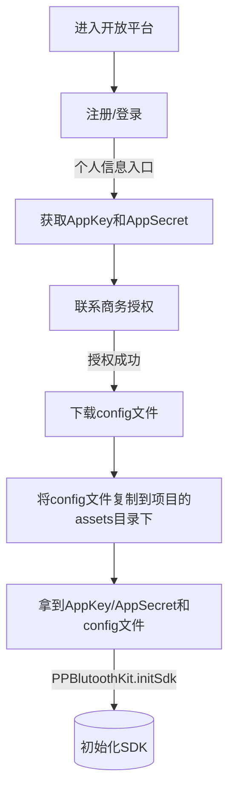

### 1.2 SDK初始化
```  
 //使用时请务必替换成你自己的AppKey/AppSecret，需要增加设备配置请联系我司销售顾问  
 val appKey = "" val appSecret = ""  
 /*********************以下内容为SDK的配置项***************************************/  
 //SDK日志打印控制，true会打印  
 PPBlutoothKit.setDebug(BuildConfig.DEBUG) /** * SDK 初始化 所需参数需要自行到开放平台自行申请，请勿直接使用Demo中的参数，  
 * @param appKey App的标识  
 * @param appSecret Appp的密钥  
 * @param configPath 在开放平台下载相应的配置文件以.config结尾，并放到assets目录下，将config文件全名传给SDK  
 */ PPBlutoothKit.initSdk(this, appKey, appSecret, "lefu.config")```  
  
### 1.3 aar文件导入  
  
- 在需要引入sdk的module下的build.gradle中加入(最新版本请查看ppscalelib的module下的libs)  
  
```  
dependencies { //aar引入  
api(name: 'ppblutoothkit-3.1.0-20230829.165034-1', ext: 'aar') }
```  
### 1.4 集成常见问题  
  
- 如果遇到集成后提示“AndroidManifest.xml”相关的报错，请尝试着在主module中加入以下代码解决：  
  
```  
android { ``` packagingOptions { exclude 'AndroidManifest.xml' ``` } }```

- 如果遇到“.so”类型的文件错误，请尝试清除缓存，并将集成sdk的方式改为api

- 如遇到其他集成的问题请咨询：yanfabu-5@lefu.cc 或联系我们的销售顾问

- 如你有好的建议或优秀的代码你可以在Gitee上提交你的请求，我们会非常感谢你

## Ⅱ .使用说明

### 1.1 蓝牙权限相关

#### 1.1.1 运行环境

由于需要蓝牙连接，Demo需要真机运行，Android手机6.0及以上或HarmonyOS2.0及以上

#### 1.1.2 蓝牙权限相关约定

使用Demo过程中需要您打开蓝牙，打开定位开关，需确保开启和授权必要的权限: 精准定位权限和附近的设备权限  
可以查看官方蓝牙权限文档，文档地址：[Google开发者网站关于Bluetooth permissions说明](https://developer.android.com/guide/topics/connectivity/bluetooth/permissions).

- 精准定位权限
- 附近设备权限
- 定位开关
- 蓝牙开关

```  
<manifest>  
 <!-- Request legacy Bluetooth permissions on older devices. --> <uses-permission android:name="android.permission.BLUETOOTH" android:maxSdkVersion="30" /> <uses-permission android:name="android.permission.BLUETOOTH_ADMIN" android:maxSdkVersion="30" />  
 <!-- Needed only if your app looks for Bluetooth devices. If your app doesn't use Bluetooth scan results to derive physical location information, you can strongly assert that your app doesn't derive physical location. --> <uses-permission android:name="android.permission.BLUETOOTH_SCAN" />  
 <!-- Needed only if your app makes the device discoverable to Bluetooth devices. --> <uses-permission android:name="android.permission.BLUETOOTH_ADVERTISE" />  
 <!-- Needed only if your app communicates with already-paired Bluetooth devices. --> <uses-permission android:name="android.permission.BLUETOOTH_CONNECT" />  
 <!-- Needed only if your app uses Bluetooth scan results to derive physical location. --> <uses-permission android:name="android.permission.ACCESS_FINE_LOCATION" /> ...</manifest>  
  
```  

### 1.2 测量身体数据相关约定

#### 1.2.1 称重测脂注意事项

- 秤支持测脂
- 光脚上称，并接触对应的电极片
- 称重接口返回体重(kg)和阻抗信息
- 人体参数身高、年龄输入正确

#### 1.2.2 体脂计算

##### 基础参数约定
| 类别 | 输入范围 | 单位 |  
|:----|:--------|:--:|  
| 身高 | 100-220 | cm |  
| 年龄 | 10-99   | 岁 |  
| 性别 | 0/1     | 女/男 |  
| 体重 | 10-200   | kg |

- 需要身高、年龄、性别和对应的阻抗，调用对应的计算库去获得
- 8电极所涉及的体脂数据项需要8电极的秤才可使用

##  Ⅲ. 计算体脂 - Caclulate - CalculateManagerActivity

### 1.1  体脂计算所需参数说明

根据蓝牙协议解析出的体重、阻抗，加上用户数据的身高、年龄、性别，计算出体脂率等多项体脂参数信息。

#### 1.1.1   PPBodyBaseModel
| 参数   | 注释|  说明 |
| :--------  | :-----  | :----:  |
| weight | 体重 | 实际体重*100取整|
| impedance|四电极算法阻抗 |四电极算法字段|
| zTwoLegsDeCode|四电极脚对脚明文阻抗值 |四电极算法字段|
| userModel|用户基础信息对象 |PPUserModel|
| deviceModel-deviceCalcuteType| 对应设备的计算方式 |后面具体说明|
| isHeartRating| 是否正在测量心率 |心率测量状态|
| unit| 秤端的当前单位 |实时单位|
| heartRate| 心率 |秤端支持心率生效|
| isPlus| 是否是正数 |食物秤生效|
| memberId| 成员Id |秤端支持用户时生效|
| z100KhzLeftArmEnCode| 100KHz左手阻抗加密值 |八电极字段|
| z100KhzLeftLegEnCode| 100KHz左腳阻抗加密值 |八电极字段|
| z100KhzRightArmEnCode| 100KHz右手阻抗加密值 |八电极字段|
| z100KhzRightLegEnCode| 100KHz右腳阻抗加密值 |八电极字段|
| z100KhzTrunkEnCode| 100KHz軀幹阻抗加密值 |八电极字段|
| z20KhzLeftArmEnCode| 20KHz左手阻抗加密值 |八电极字段|
| z20KhzLeftLegEnCode| 20KHz左腳阻抗加密值 |八电极字段|
| z20KhzRightArmEnCode|20KHz右手阻抗加密值 |八电极字段|
| z20KhzRightLegEnCode| 20KHz右腳阻抗加密值 |八电极字段|
| z20KhzTrunkEnCode| 20KHz軀幹阻抗加密值 |八电极字段|
| z100KhzLeftArmDeCode| 100KHz左手阻抗解密值 |八电极字段|
| z100KhzLeftLegDeCode| 100KHz左腳阻抗解密值 |八电极字段|
| z100KhzRightArmDeCode| 100KHz右手阻抗解密值 |八电极字段|
| z100KhzRightLegDeCode| 100KHz右腳阻抗解密值 |八电极字段|
| z100KhzRightArmDeCode| 100KHz左手阻抗解密值 |八电极字段|
| z100KhzTrunkDeCode| 100KHz軀幹阻抗解密值 |八电极字段|
| z20KhzLeftArmDeCode| 20KHz左手阻抗解密值 |八电极字段|
| z20KhzLeftLegDeCode| 20KHz左腳阻抗解密值 |八电极字段|
| z20KhzRightArmDeCode| 20KHz右手阻抗解密值 |八电极字段|
| z20KhzRightLegDeCode| 20KHz右腳阻抗解密值 |八电极字段|
| z20KhzTrunkDeCode| 20KHz軀幹阻抗解密值 |八电极字段|

#### 1.1.2 计算类型说明  PPDeviceModel - deviceCalcuteType
| PPDeviceCalcuteType   | 注释|  使用范围 |
| :--------  | :-----  | :----:  |
| PPDeviceCalcuteTypeInScale | 秤端计算 | 秤端计算的秤|
| PPDeviceCalcuteTypeDirect| 直流 | 四电极直流体脂秤|
| PPDeviceCalcuteTypeAlternate| 四电极交流 | 四电极体脂秤|
| PPDeviceCalcuteTypeAlternate8| 8电极交流算法 | 八电极体脂秤|
| PPDeviceCalcuteTypeNormal| 默认计算方式 | 4电极交流 |
| PPDeviceCalcuteTypeNeedNot| 不需要计算 | 食物秤或人体秤|
| PPDeviceCalcuteTypeAlternate8_0| 8电极算法 |八电极体脂秤|

#### 1.1.3 用户基础信息说明 PPUserModel
| 参数   | 注释|  说明 |
| :--------  | :-----  | :----:  |
| userHeight| 身高|所有体脂秤|
| age| 年龄 |所有体脂秤|
| sex| 性别 |所有体脂秤|

### 1.2  八电极交流体脂计算 - 8AC - Calculate8Activitiy

**八电极计算体脂示例:**

```
 //八电极计算类型  
 deviceModel.deviceCalcuteType = PPScaleDefine.PPDeviceCalcuteType.PPDeviceCalcuteTypeAlternate8  

val userModel = PPUserModel.Builder()  
    .setSex(sex) //gender  
  .setHeight(height)//height 100-220  
  .setAge(age)//age 10-99  
  .build()  
  
val deviceModel = PPDeviceModel("", DeviceManager.CF568_CF577)//更换成你自己的设备蓝牙名称
deviceModel.deviceCalcuteType = PPScaleDefine.PPDeviceCalcuteType.PPDeviceCalcuteTypeAlternate8  
deviceModel.deviceAccuracyType = if (DeviceUtil.Point2_Scale_List.contains(deviceModel.deviceName)) {  
    PPScaleDefine.PPDeviceAccuracyType.PPDeviceAccuracyTypePoint005  
} else {  
    PPScaleDefine.PPDeviceAccuracyType.PPDeviceAccuracyTypePoint01  
}  
val bodyBaseModel = PPBodyBaseModel()  
bodyBaseModel.weight = UnitUtil.getWeight(weight)  
bodyBaseModel.deviceModel = deviceModel  
bodyBaseModel.userModel = userModel  
  
bodyBaseModel.z100KhzLeftArmEnCode = z100KhzLeftArmEnCode  
bodyBaseModel.z100KhzLeftLegEnCode = z100KhzLeftLegEnCode  
bodyBaseModel.z100KhzRightArmEnCode = z100KhzRightArmEnCode  
bodyBaseModel.z100KhzRightLegEnCode = z100KhzRightLegEnCode  
bodyBaseModel.z100KhzTrunkEnCode = z100KhzTrunkEnCode  
bodyBaseModel.z20KhzLeftArmEnCode = z20KhzLeftArmEnCode  
bodyBaseModel.z20KhzLeftLegEnCode = z20KhzLeftLegEnCode  
bodyBaseModel.z20KhzRightArmEnCode = z20KhzRightArmEnCode  
bodyBaseModel.z20KhzRightLegEnCode = z20KhzRightLegEnCode  
bodyBaseModel.z20KhzTrunkEnCode = z20KhzTrunkEnCode  
  
val fatModel = PPBodyFatModel(bodyBaseModel)  
  
DataUtil.util().bodyDataModel = fatModel  
Log.d("liyp_", fatModel.toString())
 ```  

### 1.3   四电极直流体脂计算 - 4DC - Calculate4DCActivitiy

**四电极直流计算体脂示例:**
  ```  
val userModel = PPUserModel.Builder()  
    .setSex(sex) //gender  
  .setHeight(height)//height 100-220  
  .setAge(age)//age 10-99  
  .build()  
  
val deviceModel = PPDeviceModel("", DeviceManager.FL_SCALE)//更换成你自己的设备蓝牙名称
deviceModel.deviceCalcuteType = PPScaleDefine.PPDeviceCalcuteType.PPDeviceCalcuteTypeDirect  
val bodyBaseModel = PPBodyBaseModel()  
bodyBaseModel.weight = UnitUtil.getWeight(weight)  
bodyBaseModel.impedance = impedance  
bodyBaseModel.deviceModel = deviceModel  
bodyBaseModel.userModel = userModel  
bodyBaseModel.unit = PPUnitType.Unit_KG  
  
val ppBodyFatModel = PPBodyFatModel(bodyBaseModel)  
  
DataUtil.util().bodyDataModel = ppBodyFatModel  
Log.d("liyp_", ppBodyFatModel.toString())
```  


### 1.4  四电极交流体脂计算 - 4AC - Calculate4ACActivitiy

**四电极交流计算体脂示例:**
```
val userModel = PPUserModel.Builder()  
    .setSex(sex) //gender  
  .setHeight(height)//height 100-220  
  .setAge(age)//age 10-99  
  .build()  
  
val deviceModel = PPDeviceModel("", DeviceManager.CF568)///更换成你自己的设备蓝牙名称
deviceModel.deviceCalcuteType = PPScaleDefine.PPDeviceCalcuteType.PPDeviceCalcuteTypeAlternate  
deviceModel.deviceAccuracyType = if (DeviceUtil.Point2_Scale_List.contains(deviceModel.deviceName)) {  
    PPScaleDefine.PPDeviceAccuracyType.PPDeviceAccuracyTypePoint005  
} else {  
    PPScaleDefine.PPDeviceAccuracyType.PPDeviceAccuracyTypePoint01  
}  
  
val bodyBaseModel = PPBodyBaseModel()  
bodyBaseModel.weight = UnitUtil.getWeight(weight)  
bodyBaseModel.impedance = impedance  
bodyBaseModel.deviceModel = deviceModel  
bodyBaseModel.userModel = userModel  
bodyBaseModel.unit = PPUnitType.Unit_KG  
  
val ppBodyFatModel = PPBodyFatModel(bodyBaseModel)  
DataUtil.util().bodyDataModel = ppBodyFatModel  
Log.d("liyp_", ppBodyFatModel.toString())
```
##  Ⅳ. 设备扫描 - Device-ScanDeviceListActivity

### 1.1 设备分类定义-  PPDevicePeripheralType

扫描设备会返回PPDeviceModel对象，通过设备的方法：deviceModel.getDevicePeripheralType()，获取设备分类，根据PPDevicePeripheralType区分自己的设备，对应设备功能示例的Activity。

| 分类枚举 | 使用示例类 | 连接方式 | 设备类型 |协议类型
|------|--------|--------|--------|  --------|
| PeripheralApple | PeripheralAppleActivity | 连接 | 人体秤  | 2.x
| PeripheralBanana | PeripheralBananaActivity | 广播 | 人体秤  | 2.x
| PeripheralCoconut | PeripheralCoconutActivity | 连接 | 人体秤  | 3.x
| PeripheralDurian | PeripheralDutianActivity | 设备端计算的连接 | 人体秤 | 2.x
| PeripheralEgg | PeripheralEggActivity | 连接 | 厨房秤  | 2.x
| PeripheralFish | PeripheralFishActivity | 连接 | 厨房秤  |3.x
| PeripheralGrapes | PeripheralGrapesActivity | 广播 | 厨房秤  | 2.x
| PeripheralHamburger | PeripheralHamburgerActivity | 广播 | 厨房秤 | 3.x
| PeripheralTorre | PeripheralTorreActivity | 连接 | 人体秤  | Torre
| PeripheralIce | PeripheralIceActivity | 连接 | 人体秤  | 4.x
| PeripheralJambul | PeripheralJambulActivity | 广播 | 人体秤 |  3.x

### 1.2 扫描周围支持的设备-ScanDeviceListActivity

**注意：**
- 如果你在多个页面之间需要启动扫描，建议把扫描逻辑，放到工具类中，并用单例进行包裹
- 如果有连续页面需要调用扫描时，请一定要确保上个页面的蓝牙已停止扫描后，再在第二个页面进行扫描，建议是第二个页面延迟1000ms再启动。
- 如果你需要一直扫描蓝牙，你要在monitorBluetoothWorkState方法中ppBleWorkState返回PPBleWorkState.PPBleWorkSearchTimeOut时重启扫描，以确保循环扫描

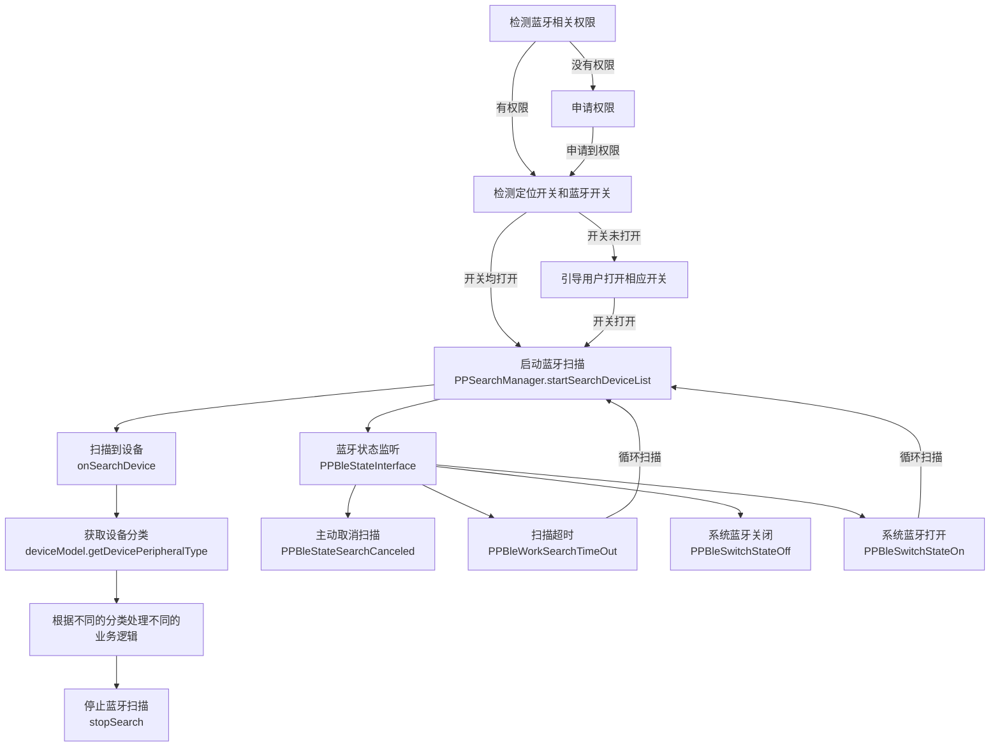

####  启动扫描 - startSearchDeviceList
```  
 /** * Get around bluetooth scale devices */
  public void startScanDeviceList() {
   if (ppScale == null) { 
   ppScale = new PPSearchManager(); 
   } 
   //You can dynamically set the scan time in ms  
   ppScale.startSearchDeviceList(300000, searchDeviceInfoInterface，bleStateInterface);  
 }  
``` 

**处理扫描结果-PPSearchDeviceInfoInterface**

```  
/**  
 * @param ppDeviceModel 设备对象  
 * @param data 广播数据  
 */
public void onSearchDevice(PPDeviceModel ppDeviceModel, String data) {}
```  
**蓝牙相关状态监听-PPBleStateInterface**

```  
/**  
 * 蓝牙扫描和连接状态回调  
  * @param ppBleWorkState 蓝牙状态标识  
  * @param deviceModel 设备对象  
  */  
@Override  
public void monitorBluetoothWorkState(PPBleWorkState ppBleWorkState, PPDeviceModel deviceModel) {}
/**  
 * 系统蓝牙状态回调  
  * @param ppBleSwitchState 系统蓝牙状态标识  
  */  
@Override  
public void monitorBluetoothSwitchState(PPBleSwitchState ppBleSwitchState) {}
```

**蓝牙状态PPBleWorkState**

| 分类枚举 | 说明 | 备注
|------|--------|--------|
| PPBleWorkStateSearching | 扫描中|
| PPBleWorkSearchTimeOut| 扫描超时| 如有需要可重启扫描
| PPBleWorkSearchFail | 扫描失败|  如有需要可重启扫描
| PPBleStateSearchCanceled| 停止扫描|  主动调用停止扫描
| PPBleWorkStateConnecting| 设备连接中|
| PPBleWorkStateConnected | 设备已连接| 连接上后，建议在PPBleWorkStateWritable中下发数据
| PPBleWorkStateConnectFailed| 连接失败|
| PPBleWorkStateDisconnected| 设备已断开|
| PPBleWorkStateWritable| 可写 | 连接后如有需要给设备发送信息，可在此依次发送

#### 停止扫描

```  
ppScale.stopSearch(); 
 ```  

#### 重启扫描
重启扫描建议延迟1-2s再启动，防止触发Android系统的频繁扫描
```  
 public void delayScan() {
	new Handler(getMainLooper()).postDelayed(new Runnable() {
	   @Override public void run() {
		   if (isOnResume) {
			     startScanDeviceList(); 
			     } 
		     } 
	  }, 1000);  
 }
 ```  
### 2.1 PeripheralApple功能说明  -PeripheralAppleActivity

**注意：**
- 默认已处理完蓝牙权限和开关检测，并匹配到PPDevicePeripheralType的类型为PeripheralApple，2.x /连接 /人体秤
- 需要自行判断是否支持历史，然后再处理历史相关功能
- 需要自行判断是否支持Wifi，然后再处理Wifi相关功能
- Wifi秤需要自行读取当前手机所连接Wifi的ssid，且只支持2.4G或2.4G&5G双模Wifi，不支持单5GWiFi
- Wifi秤配网前需要先配置域名，成功后再下发ssid和pwd
- Wifi秤上传到后台的Wifi历史数据需要Server具备相应的接口能力可咨询Server开发人员

| 功能| 方法名 | 参数 |返回数据类型|备注
|------|--------|--------|--------|--------|
|蓝牙连接| startConnect|PPDeviceModel|PPBleStateInterface| 蓝牙相关状态
|断开连接(非Wifi秤)| disConnect||PPBleStateInterface| 蓝牙相关状态
|断开连接(Wifi秤)| disWifi||PPBleSendResultCallBack| 需要下发断开连接指令，下发成功后，再调用disConnect主动断开
|同步时间| syncTime||PPBleSendResultCallBack-onResult(PPScaleSendState sendState)|发送状态回调
|读取设备信息| readDeviceInfo||PPDeviceInfoInterface-readDeviceInfoComplete|设备信息回调，部分秤支持(包括modelNumber、softwareVersion、serialNumber)
|同步单位| syncUnit |PPUnitType,PPUserModel|PPBleSendResultCallBack|发送状态回调
|注册数据变化监听| registDataChangeListener |PPDataChangeListener|monitorProcessData 过程数据<br>monitorLockData锁定数据<br>monitorOverWeight超重 |
|读取蓝牙历史| getHistoryData||PPHistoryDataInterface|monitorHistoryData历史数据回调<br>monitorHistoryEnd历史数据结束<br>monitorHistoryFail历史数据失败
|删除蓝牙历史| deleteHistoryData ||PPBleSendResultCallBack|发送状态回调
|是否支持历史| PPScaleHelper-<br> isSupportHistoryData |deviceFuncType|Boolean|true支持 false不支持
|是否支持Wifi| PPScaleHelper-<br>isFuncTypeWifi |deviceFuncType|Boolean|true支持 false不支持
|配置域名| sendModifyServerDomain |domain: String|PPConfigWifiInfoInterface|monitorModifyServerDomainSuccess修改Domain成功回调
|配网| configWifiData |ssid: String, password: String?|PPConfigWifiInfoInterface|monitorConfigSn(sn:String)<br>sn不为空代表配网成功<br>monitorConfigFail()配网失败
|读取设备的Wifi-SSID| getWiFiParmameters ||PPConfigWifiInfoInterface|monitorConfigSsid(ssid:String?)

#### 完整的称重逻辑

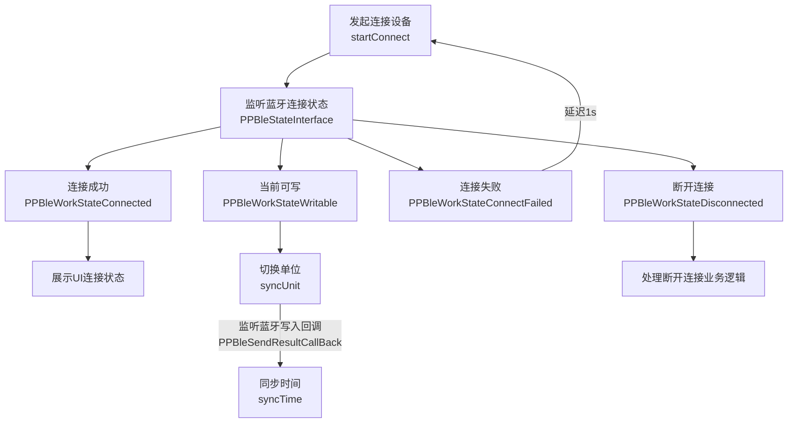
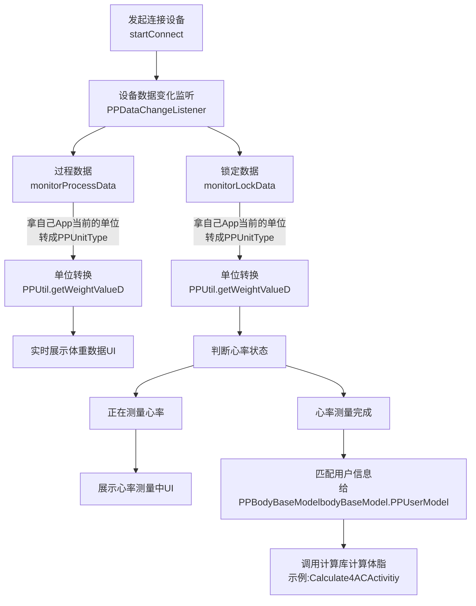
#### 完整的读取蓝牙历史数据

**前提：蓝牙已连接**
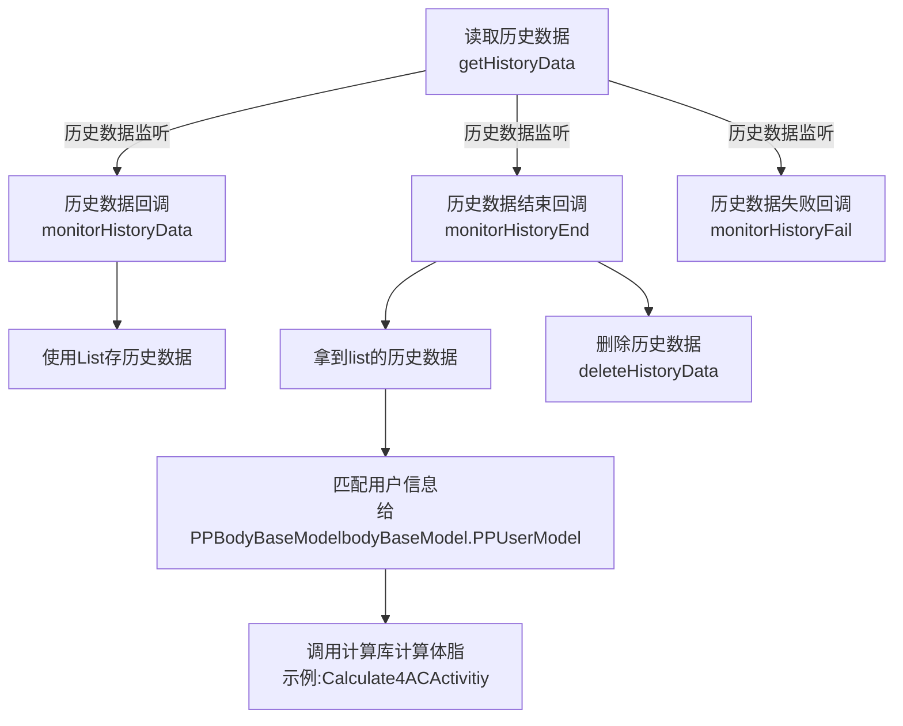
#### 完整的Wifi配网流程
**前提：蓝牙已连接**

注意：
1. 确保Server正常，路由器能正常连接到Server
2. 确保WiFi环境是2.4G或2.4/5G混合模式，不支持单5G模式
3. 确保账号密码正确
4. 确保秤端使用的Server地址与App使用的Server地址对应
5. 默认Server域名地址是：https://api.lefuenergy.com

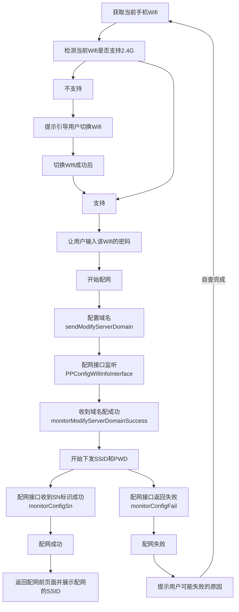


### 2.2 PeripheralBanana 功能说明  -PeripheralBanana Activity

### 2.3 PeripheralCoconut功能说明  -PeripheralCoconutActivity

### 2.4 PeripheralDurian功能说明  -PeripheralDurianActivity

### 2.5 PeripheralEgg功能说明  -PeripheralEggActivity

### 2.6 PeripheralFish功能说明  -PeripheralFishActivity

### 2.7 PeripheralGrapes功能说明  -PeripheralGrapesActivity

### 2.8 PeripheralHamburger功能说明  -PeripheralHamburgerActivity

### 2.9 PeripheralTorre功能说明  -PeripheralTorreActivity

**注意：**
- 默认已处理完蓝牙权限和开关检测，并匹配到PPDevicePeripheralType的类型为PeripheralTorre，TORRE/连接 /人体秤
- 需要自行判断是否支持历史，然后再处理历史相关功能
- 需要自行判断是否支持Wifi，然后再处理Wifi相关功能

#### 2.9.1完整的称重流程

**前提：蓝牙已连接**
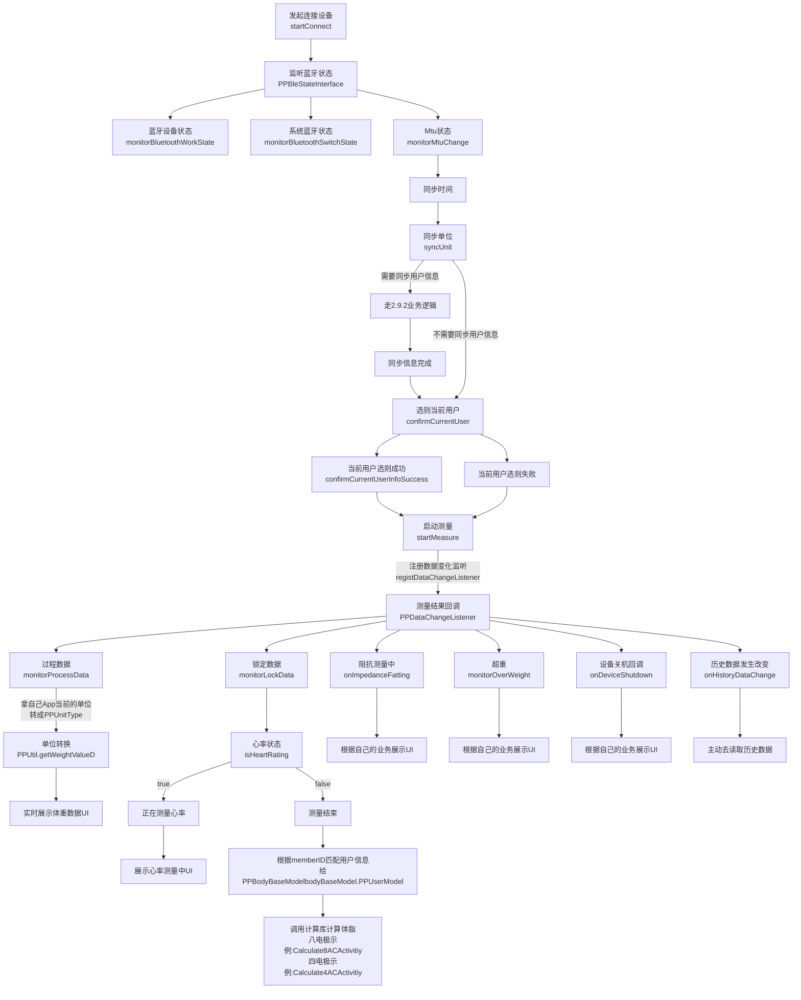
#### 2.9.2完整的用户信息同步流程

**前提：蓝牙已连接**
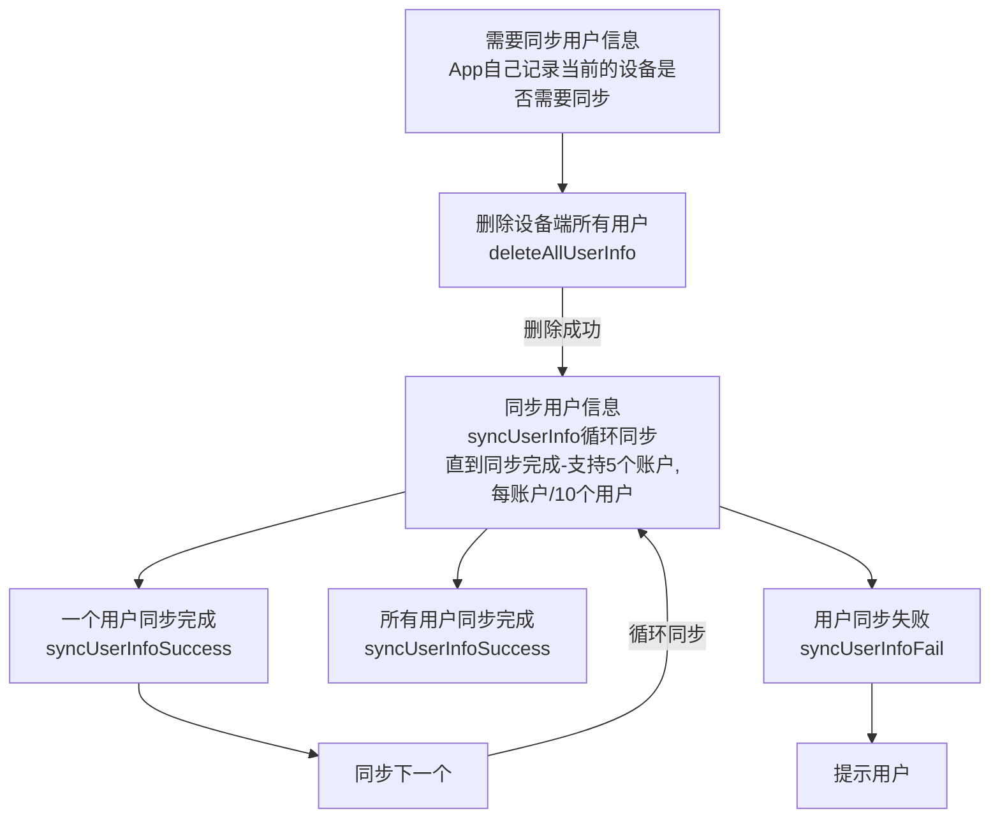
#### 2.9.3完整的配网流程
**前提：蓝牙已连接**
注意：
1. 确保Server正常，路由器能正常连接到Server
2. 确保WiFi环境是2.4G或2.4/5G混合模式，不支持单5G模式
3. 确保账号密码正确
4. 确保秤端使用的Server地址与App使用的Server地址对应

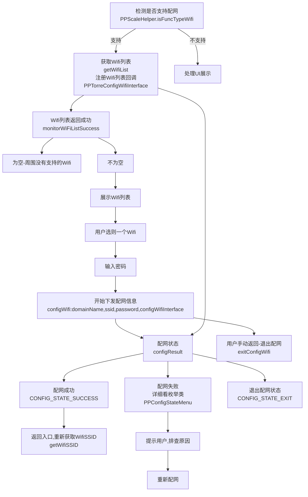
#### 2.9.4 完整的蓝牙历史数据读取
**前提：蓝牙已连接**
- 有主用户历史：指有有效的memberID的历史数据
- 无主用户历史：指没有有效的memberID的历史数据,memberID全为64个0或为空
- 有主用户历史数据同步
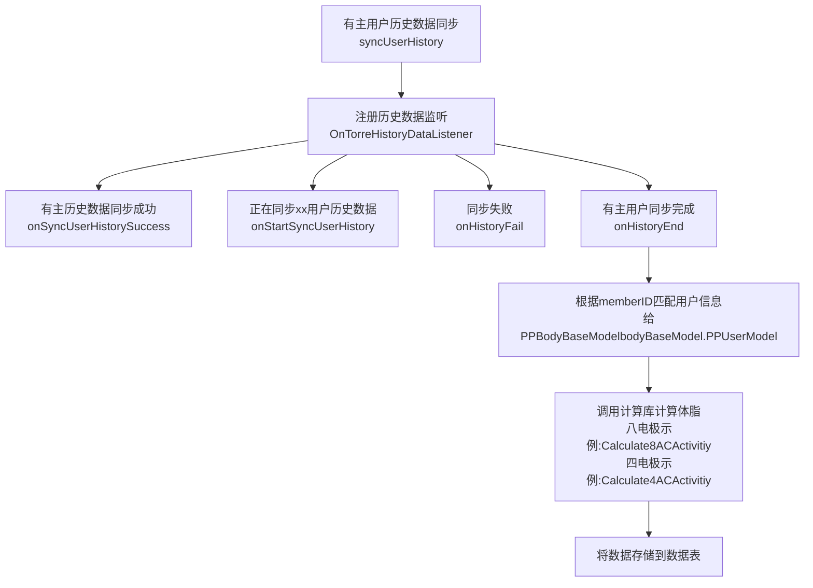
- 无主用户历史数据同步
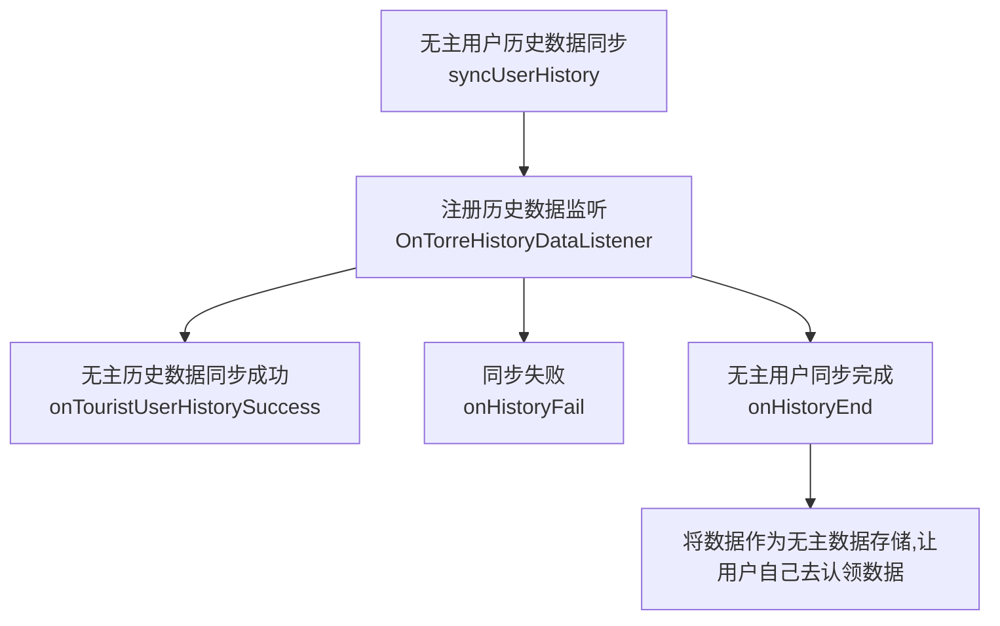


| 功能| 方法名 | 参数 |返回数据类型|备注
|------|--------|--------|--------|--------|
|蓝牙连接| startConnect|PPDeviceModel|PPBleStateInterface| 蓝牙相关状态
|启动测量| startMeasure||PPDataChangeListener| 蓝牙相关状态
|停止测量| stopMeasure|PPDeviceModel|PPBleStateInterface| 蓝牙相关状态
|同步时间| syncTime||PPBleSendResultCallBack-onResult(PPScaleSendState sendState)|发送状态回调
|读取设备信息| readDeviceInfo||PPDeviceInfoInterface-readDeviceInfoComplete|设备信息回调，部分秤支持(包括modelNumber、softwareVersion、serialNumber)
|同步单位| syncUnit |PPUnitType,PPUserModel|PPBleSendResultCallBack|发送状态回调
|注册数据变化监听| registDataChangeListener |PPDataChangeListener|monitorProcessData 过程数据<br>monitorLockData锁定数据<br>monitorOverWeight超重 |
|是否支持历史| PPScaleHelper-<br> isSupportHistoryData |deviceFuncType|Boolean|true支持 false不支持
|是否支持Wifi| PPScaleHelper-<br>isFuncTypeWifi |deviceFuncType|Boolean|true支持 false不支持
|同步用户数据| syncUserInfo |PPUserModel|PPUserInfoInterface|同步多个用户要一个一个同步
|删除用户数据| deleteAllUserInfo |deviceFuncType|PPUserInfoInterface|根据userID去删除该userId下的所有子成员
|确认当前用户| confirmCurrentUser |PPUserModel|PPUserInfoInterface|
|获取用户列表| getUserList ||PPUserInfoInterface|true支持 false不支持
|开始配网| startConfigWifi ||Boolean|true支持 false不支持
|获取SSID| getWifiSSID |deviceFuncType|Boolean|true支持 false不支持
|获取WifiMac| getWifiMac |deviceFuncType|Boolean|true支持 false不支持
|清除用户| clearDeviceUserInfo |deviceFuncType|Boolean|true支持 false不支持
|获取单位| getUnit |deviceFuncType|Boolean|true支持 false不支持
|设备信息| readDeviceInfoFromCharacter |deviceFuncType|Boolean|true支持 false不支持
|获取电量| readDeviceBattery |deviceFuncType|Boolean|true支持 false不支持
|获取亮度| getLight |deviceFuncType|Boolean|true支持 false不支持
|设置亮度| setLight |light|Boolean|0-100
|用户历史数据| syncUserHistory |PPUserModel|PPHistoryDataInterface|
|游客历史数据| syncTouristHistory ||PPHistoryDataInterface|
|恢复出厂| resetDevice |deviceFuncType|Boolean|true支持 false不支持
|启动保活| startKeepAlive ||无需主动退出保活|

### 2.10 PeripheralIce功能说明  -PeripheralIceActivity

### 2.11 PeripheralJambul功能说明  -PeripheralJambulActivity

## V .实体类对象及具体参数说明

### 1.1 PPBodyFatModel 体脂计算对象参数说明
四电极对应的24项数据
八电极对应的48项数据
| 参数| 参数类型 | 说明 |数据类型|备注
|------|--------|--------|--------|--------|
|ppBodyBaseModel| PPBodyBaseModel |体脂计算的入参|基础入参|包含设备信息、用户基础信息、体重和心率|体脂秤
|ppSDKVersion| String |计算库版本号|返回参数|
|ppSex| PPUserGender|性别|返回参数| PPUserGenderFemale女<br>PPUserGenderMale男
|ppHeightCm|Int |身高|返回参数|cm
|ppAge|Int |年龄|返回参数|岁
|errorType|BodyFatErrorType |错误类型|返回参数|PP_ERROR_TYPE_NONE(0),无错误                      <br>PP_ERROR_TYPE_AGE(1), 年龄有误   <br>PP_ERROR_TYPE_HEIGHT(2),身高有误               <br>PP_ERROR_TYPE_WEIGHT(3), 体重有误 <br>PP_ERROR_TYPE_SEX(4) 性別有误 <br>PP_ERROR_TYPE_PEOPLE_TYPE(5)  <br>以下是阻抗有误 <br>PP_ERROR_TYPE_IMPEDANCE_TWO_LEGS(6)  <br>PP_ERROR_TYPE_IMPEDANCE_TWO_ARMS(7)<br>PP_ERROR_TYPE_IMPEDANCE_LEFT_BODY(8)  <br>PP_ERROR_TYPE_IMPEDANCE_RIGHT_ARM(9)<br>PP_ERROR_TYPE_IMPEDANCE_LEFT_ARM(10)  <br>PP_ERROR_TYPE_IMPEDANCE_LEFT_LEG(11)  <br>PP_ERROR_TYPE_IMPEDANCE_RIGHT_LEG(12)  <br>PP_ERROR_TYPE_IMPEDANCE_TRUNK(13)
|bodyDetailModel|PPBodyDetailModel|数据区间范围和介绍描述|
|ppWeightKg|Float |体重|24&48|kg
|ppBMI|Float|Body Mass Index|24&48|
|ppFat|Float |脂肪率|24&48|%
|ppBodyfatKg|Float |脂肪量|24&48|kg
|ppMusclePercentage|Float |肌肉率|24&48|%
|ppMuscleKg|Float |肌肉量|24&48|kg
|ppBodySkeletal|Float |骨骼肌率|24&48|%
|ppBodySkeletalKg|Float |骨骼肌量|24&48|kg
|ppWaterPercentage|Float |水分率|24&48|%
|ppWaterKg|Float |水分量|24&48|kg
|ppProteinPercentage|Float |蛋白质率|24&48|%
|ppProteinKg|Float |蛋白质量|24&48|kg
|ppLoseFatWeightKg|Float |去脂体重|24&48|kg
|ppBodyFatSubCutPercentage|Float |皮下脂肪率|24&48|%
|ppBodyFatSubCutKg|Float |皮下脂肪量|24&48|kg
|ppHeartRate|Int |心率|24&48|bmp该值与秤有关，且大于0为有效
|ppBMR|Int |基础代谢|24&48|
|ppVisceralFat|Int |内脏脂肪等级|24&48|
|ppBoneKg|Float |骨量|24&48|kg
|ppBodyMuscleControl|Float |肌肉控制量|24&48|kg
|ppFatControlKg|Float |脂肪控制量|24&48|kg
|ppBodyStandardWeightKg|Float |标准体重|24&48|kg
|ppIdealWeightKg|Float |理想体重|24&48|kg
|ppControlWeightKg|Float |控制体重|24&48|kg
|ppBodyType|PPBodyDetailType |身体类型|24&48|PPBodyDetailType有单独说明
|ppFatGrade|PPBodyFatGrade|肥胖等级|24&48|PPBodyGradeFatThin(0),              //!< 偏瘦  <br>PPBodyGradeFatStandard(1),//!< 标准  <br>PPBodyGradeFatOverwight(2), //!< 超重  <br>PPBodyGradeFatOne(3),//!< 肥胖1级  <br>PPBodyGradeFatTwo(4),//!< 肥胖2级  <br>PPBodyGradeFatThree(5);//!< 肥胖3级
|ppBodyHealth|PPBodyHealthAssessment |健康评估|24&48|PPBodyAssessment1(0),          //!< 健康存在隐患  <br>PPBodyAssessment2(1),          //!< 亚健康  <br>PPBodyAssessment3(2),          //!< 一般  <br>PPBodyAssessment4(3),          //!< 良好  <br>PPBodyAssessment5(4);          //!< 非常好
|ppBodyAge|Int|身体年龄|24&48|岁
|ppBodyScore|Int |身体得分|24&48|分
|ppCellMassKg|Float |身体细胞量|48|kg
|ppDCI|Int |建议卡路里摄入量|48|Kcal/day
|ppMineralKg|Float |无机盐量|48|kg
|ppObesity|Float |肥胖度|48|%
|ppWaterECWKg|Float |细胞外水量|48|kg
|ppWaterICWKg|Float |细胞内水量|48|kg
|ppBodyFatKgLeftArm|Float |左手脂肪量|48|kg
|ppBodyFatKgLeftLeg|Float |左脚脂肪量|48|kg
|ppBodyFatKgRightArm|Float |右手脂肪量|48|kg
|ppBodyFatKgRightLeg|Float |右脚脂肪量|48|kg
|ppBodyFatKgTrunk|Float |躯干脂肪量|48|kg
|ppBodyFatRateLeftArm|Float |左手脂肪率|48|%
|ppBodyFatRateLeftLeg|Float |左脚脂肪率|48|%
|ppBodyFatRateRightArm|Float |右手脂肪率|48|%
|ppBodyFatRateRightLeg|Float |右脚脂肪率|48|%
|ppBodyFatRateTrunk|Float |躯干脂肪率|48|%
|ppMuscleKgLeftArm|Float |左手肌肉量|48|kg
|ppMuscleKgLeftLeg|Float |左脚肌肉量|48|kg
|ppMuscleKgRightArm|Float |右手肌肉量|48|kg
|ppMuscleKgRightLeg|Float |右脚肌肉量|48|kg
|ppMuscleKgTrunk|Float |躯干肌肉量|48|kg

注意：在使用时拿到对象，请调用对应的get方法来获取对应的值

### 1.2 身体类型-PPBodyDetailType
| 参数| 说明| type |
|------|--------|--------|
|LF_BODY_TYPE_THIN|偏瘦型|0
|LF_BODY_TYPE_THIN_MUSCLE|偏瘦肌肉型|1
|LF_BODY_TYPE_MUSCULAR|肌肉发达型|2
|LF_BODY_TYPE_LACK_EXERCISE|缺乏运动型|3
|LF_BODY_TYPE_STANDARD|标准型|4
|LF_BODY_TYPE_STANDARD_MUSCLE|标准肌肉型|5
|LF_BODY_TYPE_OBESE_FAT|浮肿肥胖型|6
|LF_BODY_TYPE_FAT_MUSCLE|偏胖肌肉型|7
|LF_BODY_TYPE_MUSCLE_FAT|肌肉型偏胖|8

### 1.3 设备对象-PPDeviceModel

| 属性名 | 类型 | 描述 |备注
| ------ | ---- | ---- | ---- |
| deviceMac | String | 设备mac|设备唯一标识
| deviceName | String | 设备蓝牙名称 |设备名称标识
| devicePower | Int | 电量 |-1标识不支持 >0为有效值
| rssi | Int | 蓝牙信号强度 |
| firmwareVersion | String? | 固件版本号 |要在连接后主动调用readDeviceInfo
| hardwareVersion | String? | 硬件版本号 |要在连接后主动调用readDeviceInfo
| manufacturerName | String? | 制造商 |要在连接后主动调用readDeviceInfo
| softwareVersion | String? | 软件版本号 |要在连接后主动调用readDeviceInfo
| serialNumber | String? | 序列号 |要在连接后主动调用readDeviceInfo
| modelNumber | String? | 时区编号 |要在连接后主动调用readDeviceInfo
| deviceType | PPDeviceType | 设备类型 |PPDeviceTypeUnknow, //未知  <br>PPDeviceTypeCF,//体脂秤  <br>PPDeviceTypeCE, //体重秤  <br>PPDeviceTypeCB,// 婴儿秤  <br>PPDeviceTypeCA; // 厨房秤
| deviceProtocolType | PPDeviceProtocolType | 协议模式 |  PPDeviceProtocolTypeUnknow(0),//未知 <br>PPDeviceProtocolTypeV2(1),//使用V2.x蓝牙协议    <br>  PPDeviceProtocolTypeV3(2),//使用V3.x蓝牙协议  <br>PPDeviceProtocolTypeTorre(3),//Torre协议    <br> PPDeviceProtocolTypeV4(4);//V4.0协议
| deviceCalcuteType | PPDeviceCalcuteType | 计算方式 |PPDeviceCalcuteTypeUnknow(0),//未知  <br> PPDeviceCalcuteTypeInScale(1), //秤端计算  <br> PPDeviceCalcuteTypeDirect(2), //直流4DC  <br> PPDeviceCalcuteTypeAlternate(3),//交流4AC  br> PPDeviceCalcuteTypeAlternate8(4),// 8电极交流算法  <br> PPDeviceCalcuteTypeNormal(5), //默认默认体脂率采用原始值-4AC  <br> PPDeviceCalcuteTypeNeedNot(6),//不需要计算  <br> PPDeviceCalcuteTypeAlternate8_0(7);//8电极算法，bhProduct =0
| deviceAccuracyType | PPDeviceAccuracyType | 精度 |PPDeviceAccuracyTypeUnknow(0), //未知精度                                   <br> PPDeviceAccuracyTypePoint01(1), //精度0.1                                                                                <br> PPDeviceAccuracyTypePoint005(2),//精度0.05                                                                           <br> PPDeviceAccuracyTypePointG(3),  // 1G精度                                                                                     <br> PPDeviceAccuracyTypePoint01G(4), // 0.1G精度                                                                          <br> PPDeviceAccuracyTypePoint001(5); //0.01KG精度
| devicePowerType | PPDevicePowerType | 供电模式 |PPDevicePowerTypeUnknow(0),//未知                                    <br>PPDevicePowerTypeBattery(1),//电池供电                                                                               <br>PPDevicePowerTypeSolar(2),//太阳能供电                                                                                     <br>PPDevicePowerTypeCharge(3); //充电款
| deviceConnectType | PPDeviceConnectType | 设备连接类型 |PPDeviceConnectTypeUnknow(0),  <br>PPDeviceConnectTypeBroadcast(1), //广播  <br>PPDeviceConnectTypeDirect(2),//直连  <br>PPDeviceConnectTypeBroadcastOrDirect(3); //广播或直连
| deviceFuncType | Int | 功能类型 | PPScaleHelper-isSupportHistoryData//判断是否支持历史                     <br>PPScaleHelper-isFuncTypeWifi//判断是否支持Wifi                                                             <br>PPScaleHelper-isFat//判断是否支持测脂
| deviceUnitType | String | 支持的单位 |采用","隔开,对应PPUnitType的type

### 1.4 设备单位-PPUnitType

| 枚举类型 | type | 单位 |
| -- | ---- |---- |
|Unit_KG| 0 | KG |
|Unit_LB| 1 | LB |
|PPUnitST_LB| 2 | ST_LB |
|PPUnitJin| 3 | 斤 |
|PPUnitG| 4 | g |
|PPUnitLBOZ| 5 | lb:oz |
|PPUnitOZ| 6 | oz |
|PPUnitMLWater| 7 | ml（水） |
|PPUnitMLMilk| 8 | ml（牛奶） |
|PPUnitFL_OZ_WATER| 9 | fl_oz（水） |
|PPUnitFL_OZ_MILK| 10 | fl_oz（牛奶） |
|PPUnitST| 11 | ST |

### 2.0 食物秤-LFFoodScaleGeneral参数说明

| 属性名 | 类型 | 描述 |
| ------ | ---- | ---- |
| lfWeightKg | double | 重量 |
| unit | PPUnitType | 单位 |
| byteNum | int | 字节数 |
| thanZero | int | 正负标识 |
| scaleType | String | 秤类型 |


## VI. [版本更新说明](doc/version_update.md)

## VII. 使用的第三方库

### 1、芯片方案商提供的体脂计算库

### 2、[bluetoothkit1.4.0 蓝牙库](https://github.com/dingjikerbo/Android-BluetoothKit)

## VII. [常见问题](doc/common_problem.md)

Contact Developer： Email: yanfabu-5@lefu.cc